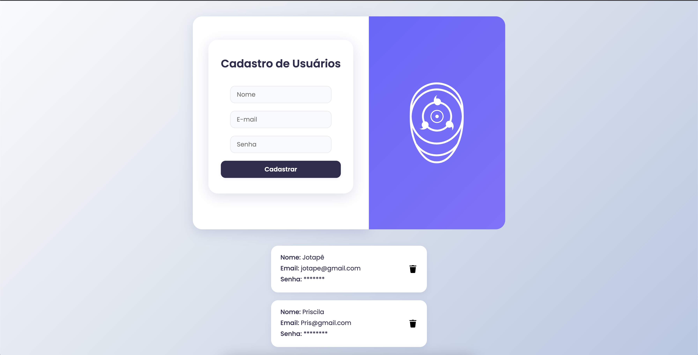

# 💻 Projeto Frontend - Cadastro de Usuários

Este é um projeto de **formulário de cadastro de usuários**, desenvolvido com **React**, **JavaScript**, **HTML** e **CSS**, com foco em design moderno, usabilidade e validações básicas de entrada.  

A aplicação funciona 100% no frontend, **sem conexão com banco de dados ou API externa**. Os dados são armazenados temporariamente em memória durante a execução.

---

## 🧩 Funcionalidades

- Interface moderna e responsiva
- Cadastro de usuários com campos: nome, e-mail e senha
- Validação básica dos campos obrigatórios
- Visualização dos usuários cadastrados
- Opção de deletar um cadastro
- Senhas ocultadas na visualização

---

## 🚀 Tecnologias Utilizadas

- React.js
- JavaScript (ES6+)
- HTML5
- CSS3 (com estilização customizada)
